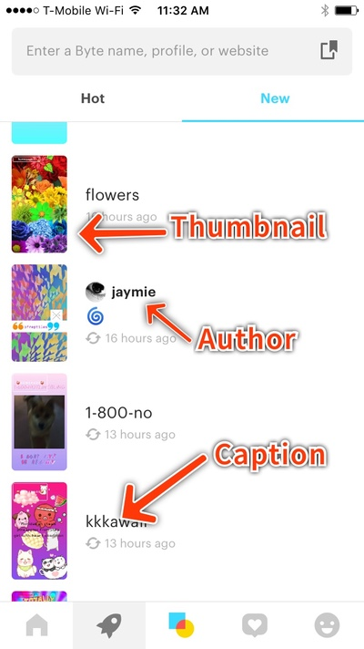
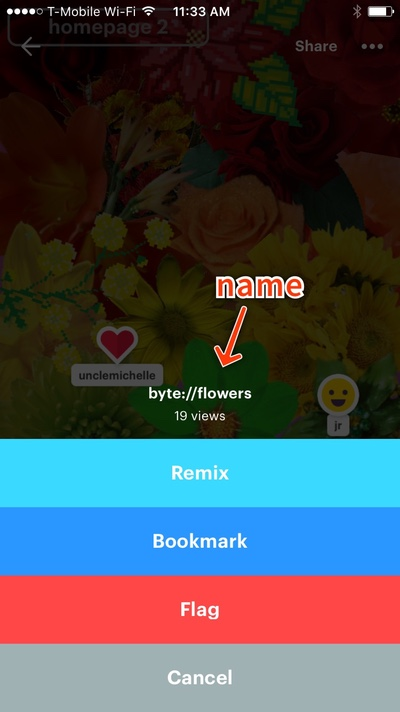

# Byte API

As far as APIs go, the Byte API is a fairly straightforward affair.

Before we get started, a few things of note:

* The base API endpoint is `https://api.byte.co/v1/`
* Always remember to use `HTTPS` for your requests
* For ease of development, appending `?pretty` (or `&pretty`, if the endpoint already has a query string) to any request endpoint will return you nicely formatted JSON
* For a successful request, the standard JSON response looks like the following:

```json
{
    "data": {},
    "success": 1
}
```
* Similarly for a failed request:

```json
{
    "data": {},
    "success": 0,
    "error": {
        "message": "Generic User Error",
        "code": 1100
    }
}
```
* We strongly recommend using gzip for your requests: `-H "User-Agent: gzip"`
* Remember to use the appropriate Content-Type (`-H "Content-Type:application/json"`) and Accept (`-H "Accept:application/json"`) headers

Okay, let's dive in!


## Contents

* [Authentication/Registration](#authenticationregistration)
* [Users](#users)
* [Names](#names)
* [Posts (Consumption)](#posts-consumption)
* [Comments](#comments)
* [Stars](#stars)
* [Flags](#flags)
* [Activity](#activity)
* [Posts (Creation)](#posts-creation)


## Authentication/Registration

The Byte API uses [JWTs](https://jwt.io) for authentication. Upon a successful `/auth` request, we'll supply you with an authorization token. This token will allow you access to authenticated endpoints when included in an `Authorization` header: `-H "Authorization: Bearer <token>"`. Each Byte account is tied to a specific phone number; authentication is handled by a one–time code sent via SMS to the phone number. We are in the process of offering secondary identifiers in case of loss of phone number.

| Method | Endpoint | Description |
| :---: | :--- | :--- |
| `POST` | [`/request-code`](#post-request-code) | Sends an authentication code to the supplied phone number. |
| `POST` | [`/auth`](#post-auth) | Registers or authenticates an account corresponding to the phone number. |


### **POST** `/request-code`

The `POST /request-code` endpoint sends a validation code to the supplied phone number.

| Parameter | Type | Description | Example |
| :---: | :---: | :--- | :--- |
| `phone` | String | Required. The user's phone number, preferably formatted to [E.164](https://en.wikipedia.org/wiki/E.164). | `"+11234567890"` |

#### Sample Query

```bash
curl -X POST -H "Content-Type:application/json" -H "Accept:application/json" https://api.byte.co/v1/request-code -d '{"phone": "<phone>"}'
```

#### Sample Response

```json
{
    "data": {},
    "success": 1
}
```
This request will trigger an SMS to the supplied phone number of the form: "Byte: Enter this code 0000"

#### Error States

| Code | Message |
| :---: | :--- |
| 1107 | User permissions error |


### **POST** `/auth`

The `POST /auth` endpoint is used for both registration and authentication. Users are currently limited to five simultaneous sessions.

| Parameter | Type | Description | Example |
| :---: | :---: | :--- | :--- |
| `phone` | String | Required. The user's phone number, preferably formatted to [E.164](https://en.wikipedia.org/wiki/E.164). | `"+11234567890"` |
| `code` | String | Required. The auth code sent via SMS to the supplied `phone`. | `"1234"` |
| `timeZone` | String | Optional. [IANA](https://en.wikipedia.org/wiki/List_of_tz_database_time_zones) time zone. Defaults to `America/New_York`. | `"America/Toronto"` |

#### Sample Query

```bash
curl -X POST -H "Content-Type:application/json" -H "Accept:application/json" https://api.byte.co/v1/auth -d '{"phone": "<phone>", "code": "<code>"}'
```

#### Sample Response

```json
{
    "data": {
        "token": "<token>",
        "user": {
            "created": 1439504708109,
            "createdString": "1439504708109",
            "timeZone": "America/Toronto",
            "id": "<userId>"
        }
    },
    "success": 1
}
```

#### Error States

| Code | Message |
| :---: | :--- |
| 1100 | Generic User Error |
| 1110 | Expired/invalid auth code |
| 1114 | User suspended |


## Users

Since Byte is mostly anonymous, user accounts aren't really accounts at all—they're simply a way of tying a set of posts to a single author. As such, we don't have much in the way of user management routes.

| Method | Endpoint | Description |
| :---: | :--- | :--- |
| `GET` | [`/status`](#get-status-requires-authentication-header) | Fetches the latest user state |
| `GET` | [`/account`](#get-account-requires-authentication-header) | Returns the account information tied to the current session token |
| `POST` | [`/account`](#post-account-requires-authentication-header) | Updates account information |
| `POST` | [`/users/self/deactivate`](#post-usersselfdeactivate-requires-authentication-header) | Deactivates the current user account |
| `POST` | [`/users/self/reactivate`](#post-usersselfreactivate-requires-authentication-header) | Reactivates the current user account |


### **GET** `/status` (requires authentication header)

The `GET /status` endpoint is a simple check to fetch the latest user state from the server.

#### Sample Query

```bash
curl -X GET -H "Authorization: Bearer <token>" -H "Accept:application/json" https://api.byte.co/v1/status
```

#### Sample Response

```json
{
    "data": {
        "username": "",
        "latestMessageString": "1440981197064",
        "latestMessage": 1440981197064,
        "userId": "<userId>",
        "messageCount": 85
    },
    "success": 1
}
```

#### Error States

| Code | Message |
| :---: | :--- |
| 1101 | User does not exist |


### **GET** `/account` (requires authentication header)

The `GET /account` endpoint returns the information for the account corresponding to the current session token.

#### Sample Query

```bash
curl -X GET -H "Authorization: Bearer <token>" -H "Accept:application/json" https://api.byte.co/v1/account
```

#### Sample Response

```json
{
    "data": {
        "username": "",
        "phoneSearchOptOut": false,
        "description": null,
        "created": 1439504708109,
        "devices": [
            {
                "app_environment": "byte.ios",
                "token": "<deviceToken>"
            }
        ],
        "createdString": "1439504708109",
        "timeZone": "America/Toronto",
        "id": "<userId>"
    },
    "success": 1
}
```

#### Error States

| Code | Message |
| :---: | :--- |
| 1101 | User does not exist |


### **POST** `/account` (requires authentication header)

The `POST /account` endpoint is used to update information for the account corresponding to the current session token.

| Parameter | Type | Description | Example |
| :---: | :---: | :--- | :--- |
| `timeZone` | String | Optional. [IANA](https://en.wikipedia.org/wiki/List_of_tz_database_time_zones) time zone. Defaults to `America/New_York`. | `"America/Toronto"` |
| `description` | String | Optional. | `""` |

#### Sample Query

```bash
curl -X POST -H "Authorization: Bearer <token>" -H "Content-Type:application/json" -H "Accept:application/json" https://api.byte.co/v1/account -d '{"timeZone": "America/New_York", "description": ""}'
```

#### Sample Response

```json
{
    "data": {
        "username": "",
        "phoneSearchOptOut": false,
        "description": "",
        "created": 1439504708109,
        "devices": [
            {
                "app_environment": "byte.ios",
                "token": "<deviceToken>"
            }
        ],
        "createdString": "1439504708109",
        "timeZone": "America/New_York",
        "id": "<userId>"
    },
    "success": 1
}
```

#### Error States

| Code | Message |
| :---: | :--- |
| 1101 | User does not exist |


### **POST** `/users/self/deactivate` (requires authentication header)

The `POST /users/self/deactivate` endpoint deactivates the current user account. Posts will not be deleted, but be warned that all corresponding Byte names (URLs) will be renamed to random names and the original names released back into the wild.

#### Sample Query

```bash
curl -X POST -H "Authorization: Bearer <token>" -H "Content-Type:application/json" -H "Accept:application/json" https://api.byte.co/v1/users/self/deactivate -d '{}'
```

#### Sample Response

```json
{
    "data": {
        "status": "inactive"
    },
    "success": 1
}
```


### **POST** `/users/self/reactivate` (requires authentication header)

The `POST /users/self/reactivate` endpoint reactivates the current user session. Posts will be restored, but remember that all corresponding Byte names (URLs) will have been renamed to random names.

#### Sample Query

```bash
curl -X POST -H "Authorization: Bearer <token>" -H "Content-Type:application/json" -H "Accept:application/json" https://api.byte.co/v1/users/self/reactivate -d '{}'
```

#### Sample Response

```json
{
    "data": {
        "status": "active"
    },
    "success": 1
}
```


## Names

Names are a Byte representation of URLs on the legacy web—they map a human–readable String name to the unique post ID. Each Byte must have a unique name. To assist with this process, we supply an endpoint for checking name availabilty; an endpoint also exists for obtaining a set of randomly generated names conforming to the Byte standards. The basic naming rules are:

* Minimum of 2 and maximum of 60 characters in length
* Valid characters are alphanumeric, `_`, and `-`
* A single `#` is allowed at the end of the name—this indicates a hidden Byte
* Original casing is stored on the Byte, but "Apple" is the same as "apple" for lookup/claim purposes

A simple Python reg–ex to enforce this rule set is: `^[-\w]{2,60}#?$`

| Method | Endpoint | Description |
| :---: | :--- | :--- |
| `GET` | [`/names`](#get-names) | Returns a set of ten randomly generated Byte names |
| `POST` | [`/name/validate`](#post-namevalidate-optional-authentication-header) | Validates a single name for Byte usage |


### **GET** `/names`

The `GET /names` endpoint returns a set of ten randomly generated names valid for Byte usage. Note that these names are available at the time of request, but may be claimed by other Bytes before the Byte creation step is completed.

#### Sample Query

```bash
curl -X GET -H "Accept:application/json" https://api.byte.co/v1/names
```

#### Sample Response

```json
{
    "data": {
        "names": [
            "-jk68bnvsqs",
            "egb5gyfi-6w",
            "n5e-fc3x54c",
            "bjzgnpiplla",
            "rorhs05_ywk",
            "f_ypauesbzk",
            "ypffiw81iou",
            "psffkjlnrc8",
            "iudle_6hbcy",
            "2mhw3a1pb8w"
        ]
    },
    "success": 1
}
```


### **POST** `/name/validate` (optional authentication header)

The `POST /name/validate` endpoint validates a single name for Byte usage; this also includes a (free!) availability check. Note that this is more of a hint than a promise, as the name may be claimed by another Byte before the Byte creation step is completed.

If an authentication header is supplied, we will also check if the corresponding user has reached their daily quota of valuable names (we throttle these claims to discourage poaching/camping).

| Parameter | Type | Description | Example |
| :---: | :---: | :--- | :--- |
| `name` | String | Required. The name to validate. | `"cat#"` |

#### Sample Query

```bash
curl -X POST -H "Accept:application/json" -H "Content-Type:application/json" https://api.byte.co/name/validate -d '{"name": "cat"}'
```

#### Sample Response

```json
{
    "data": {
        "ok": true
    },
    "success": 1
}
```

#### Error States

| Code | Message |
| :---: | :--- |
| 1012 | Invalid name |
| 1810 | Post name is unavailable |
| 1811 | Valuable names are limited daily per user |


## Posts (Consumption)

Posts are the crux of Byte—they are the Bytes themselves.

I could try and tell a wonderfully impressive story about how we tried using the name `/bytes` in the API and perhaps it conflicted with a naming scheme in some versions of iOS but I won't: Bytes are called Posts because Byte has experienced several evolutions on the road to where we are today and the API naming didn't keep up with our copywriter's brilliance. That being said, be warned that we may possibly rename these endpoints in future API versions!

Each Byte consists of a number of pieces of information:

* `package`: Defined in the [BFF (Byte File Format)](./bff.md)
* `caption`: A brief title string
* `name`: The addressable endpoint for the Byte
* `thumbnailUrl`: A url to a thumbnail image of the Byte




| Method | Endpoint | Description |
| :---: | :--- | :--- |
| `GET` | [`/posts/id/<string:post_id>`](#get-postsidstringpost_id-optional-authentication-header) | Returns a single Byte by ID |
| `POST` | [`/posts/id`](#post-postsid-optional-authentication-header) | Returns a set of Bytes by ID |
| `POST` | [`/posts/name`](#post-postsname-optional-authentication-header) | Returns one or more Bytes by name |
| `GET` | [`/posts/self`](#get-postsself-requires-authentication-header) | Returns the set of Bytes created by a user |
| `GET` | [`/posts/latest`](#get-postslatest-optional-authentication-header) | Returns a set of the most recent Bytes |
| `GET` | [`/posts/popular`](#get-postspopular-optional-authentication-header) | Returns a set of the most popular Bytes |


### **GET** `/posts/id/<string:post_id>` (optional authentication header)

The `GET /posts/id/<string:post_id>` endpoint returns a single Byte by ID.

If an authentication header is supplied, the response will set the `post.ownedByUser` Boolean accordingly, indicating whether the user has edit permissions on the Byte.

Optional query params:

* `scheme`: One of `summary` or `full`

#### Sample Query

```bash
curl -X GET -H "Authorization: Bearer <token>" -H "Accept:application/json" https://api.byte.co/v1/posts/id/<postId>
```

#### Sample Response

```json
{
    "data": {
        "post": {
            "lookCount": 284,
            "previewUrl": "<previewUrl>",
            "id": "<postId>",
            "comments": [
                {
                    "author": null,
                    "point": {
                        "y": 297.04230000000001,
                        "x": 192.88130000000001
                    },
                    "sticker": "StickerThumbsUp",
                    "created": 1439879220892,
                    "createdString": "1439879220892",
                    "postId": "<postId>",
                    "type": "sticker",
                    "id": "<commentId>"
                }
            ],
            "thumbnailSrc": "<thumbnailSrc>",
            "hidden": false,
            "boost": 0,
            "updated": 1441050296279,
            "authorType": "ByteUser",
            "deleted": false,
            "stickersCount": 11,
            "createdString": "1439504831994",
            "favCount": 16,
            "name": "<postName>",
            "thumbnails": {
                "default": {
                    "url": "<thumbnailUrl>",
                    "id": "<thumbnailId>"
                }
            },
            "package": {"<package>"},
            "ownedByUser": true,
            "created": 1439504831994,
            "caption": "<caption>",
            "updatedString": "1441050296279",
            "commentsCount": 1
        }
    },
    "success": 1
}
```

#### Error States

| Code | Message |
| :---: | :--- |
| 1801 | Post does not exist |


### **POST** `/posts/id` (optional authentication header)

The `POST /posts/id` endpoint returns a set of Bytes by ID.

If an authentication header is supplied, the response will set the `post.ownedByUser` Booleans accordingly, indicating whether the user has edit permissions on the Bytes.

Optional query params:

* `scheme`: One of `summary` or `full`

| Parameter | Type | Description | Example |
| :---: | :---: | :--- | :--- |
| `ids` | Array | Required. An array of Byte IDs (Strings). | `["<id>"]` |

#### Sample Query

```bash
curl -X POST -H "Authorization: Bearer <token>" -H "Accept:application/json" -H "Content-Type:application/json" https://api.byte.co/v1/posts/id -d '{"ids": ["<id>"]}'
```

#### Sample Response

```json
{
    "data": {
        "posts": [
            {
                "lookCount": 284,
                "previewUrl": "<previewUrl>",
                "id": "<postId>",
                "comments": [
                    {
                        "author": null,
                        "point": {
                            "y": 297.0,
                            "x": 192.0
                        },
                        "sticker": "StickerThumbsUp",
                        "created": 1439879220892,
                        "createdString": "1439879220892",
                        "postId": "<postId>",
                        "type": "sticker",
                        "id": "<commentId>"
                    }
                ],
                "thumbnailSrc": "<thumbnailSrc>",
                "hidden": false,
                "boost": 0,
                "updated": 1441050296279,
                "authorType": "ByteUser",
                "deleted": false,
                "stickersCount": 11,
                "createdString": "1439504831994",
                "favCount": 16,
                "name": "<name>",
                "thumbnails": {
                    "default": {
                        "url": "<thumbnailUrl>",
                        "id": "<thumbnailId>"
                    }
                },
                "package": {"<package>"},
                "ownedByUser": true,
                "created": 1439504831994,
                "caption": "<caption>",
                "updatedString": "1441050296279",
                "commentsCount": 1
            }
        ]
    },
    "success": 1
}
```

#### Error States

| Code | Message |
| :---: | :--- |
| 1005 | Invalid Object/Validation Error |
| 1801 | Post does not exist |


### **POST** `/posts/name` (optional authentication header)

The `POST /posts/name` endpoint returns one or more Bytes by name.

If an authentication header is supplied, the response will set the `post.ownedByUser` Booleans accordingly, indicating whether the user has edit permissions on the Bytes.

Optional query params:

* `scheme`: One of `summary` or `full`

| Parameter | Type | Description | Example |
| :---: | :---: | :--- | :--- |
| `name` | String | Optional. A single Byte name. | `"cat"` |
| `names` | Array | Optional. Array of names (Strings). | `["cat", ...]` |

One of `name` or `names` must be set.

#### Sample Query

```bash
curl -X POST -H "Authorization: Bearer <token>" -H "Accept:application/json" -H "Content-Type:application/json" https://api.byte.co/v1/posts/name -d '{"name": "<name>"}'
```

#### Sample Response

```json
{
    "data": {
        "post": {
            "lookCount": 284,
            "previewUrl": "<previewUrl>",
            "id": "<postId>",
            "comments": [
                {
                    "author": null,
                    "point": {
                        "y": 297.0,
                        "x": 192.0
                    },
                    "sticker": "StickerThumbsUp",
                    "created": 1439879220892,
                    "createdString": "1439879220892",
                    "postId": "<postId>",
                    "type": "sticker",
                    "id": "<commentId>"
                }
            ],
            "thumbnailSrc": "<thumbnailSrc>",
            "hidden": false,
            "boost": 0,
            "updated": 1441050296279,
            "authorType": "ByteUser",
            "deleted": false,
            "stickersCount": 11,
            "createdString": "1439504831994",
            "favCount": 16,
            "name": "<name>",
            "thumbnails": {
                "default": {
                    "url": "<thumbnailUrl>",
                    "id": "<thumbnailId>"
                }
            },
            "package": {"<package>"},
            "ownedByUser": true,
            "created": 1439504831994,
            "caption": "<caption>",
            "updatedString": "1441050296279",
            "commentsCount": 1
        }
    },
    "success": 1
}
```

#### Error States

| Code | Message |
| :---: | :--- |
| 1005 | Invalid Object/Validation Error |
| 1801 | Post does not exist |


### **GET** `/posts/self` (requires authentication header)

The `GET /posts/self` endpoint returns all Bytes created by the user corresponding to the authentication token.

Optional query params:

* `scheme`: One of `summary` or `full`
* `cursor`: A String designating the current position in a query result set

#### Sample Query

```bash
curl -X GET -H "Authorization: Bearer <token>" -H "Accept:application/json" https://api.byte.co/v1/posts/self
```

#### Sample Response

```json
{
  "data": {
    "cursor": "<cursor>",
    "posts": [
      {
        "updated": 1441050312977,
        "name": "<name>",
        "created": 1439516560383,
        "deleted": false,
        "stickersCount": 7,
        "createdString": "1439516560383",
        "lookCount": 7,
        "caption": "<caption>",
        "thumbnailSrc": "<thumbnailSrc>",
        "updatedString": "1441050312977",
        "favCount": 0,
        "id": "<postId>",
        "commentsCount": 1
      },
      {
        "updated": 1441050296279,
        "name": "<name>",
        "created": 1439504831994,
        "deleted": false,
        "stickersCount": 11,
        "createdString": "1439504831994",
        "lookCount": 281,
        "caption": "<caption>",
        "thumbnailSrc": "<thumbnailSrc>",
        "updatedString": "1441050296279",
        "favCount": 16,
        "id": "<postId>",
        "commentsCount": 6
      }
    ],
    "more": false
  },
  "success": 1
}
```


### **GET** `/posts/latest` (optional authentication header)

The `GET /posts/latest` endpoint returns a set of the most recent Bytes across the entire Byteverse.

If an authentication header is supplied, the response will set the `post.ownedByUser` Booleans accordingly, indicating whether the user has edit permissions on the Bytes.

Optional query params:

* `scheme`: One of `summary` or `full`
* `cursor`: A String designating the current position in a query result set

#### Sample Query

```bash
curl -X GET -H "Authorization: Bearer <token>" -H "Accept:application/json" https://api.byte.co/v1/posts/latest
```

#### Sample Response

```json
{
    "data": {
        "cursor": "<cursor>",
        "posts": [
            {
                "updated": 1441054312929,
                "name": "<name>",
                "created": 1441054312929,
                "deleted": false,
                "stickersCount": 0,
                "createdString": "1441054312929",
                "lookCount": 5,
                "caption": "<caption>",
                "thumbnailSrc": "<thumbnailSrc>",
                "updatedString": "1441054312929",
                "favCount": 0,
                "id": "<postId>",
                "commentsCount": 0
            },
        ],
        "more": true
    },
    "success": 1
}
```


### **GET** `/posts/popular` (optional authentication header)

The `GET /posts/popular` endpoint returns a set of the most popular Bytes across the entire Byteverse.

If an authentication header is supplied, the response will set the `post.ownedByUser` Booleans accordingly, indicating whether the user has edit permissions on the Bytes.

Optional query params:

* `scheme`: One of `summary` or `full`

#### Sample Query

```bash
curl -X GET -H "Authorization: Bearer <token>" -H "Accept:application/json" https://api.byte.co/v1/posts/popular
```

#### Sample Response

```json
{
    "data": {
        "posts": [
            {
                "updated": 1441021189449,
                "name": "<name>",
                "created": 1440071195668,
                "deleted": false,
                "stickersCount": 0,
                "createdString": "1440071195668",
                "lookCount": 641,
                "caption": "<caption>",
                "thumbnailSrc": "<thumbnailSrc>",
                "updatedString": "1441021189449",
                "favCount": 21,
                "id": "<postId>",
                "commentsCount": 0
            },
        ]
    },
    "success": 1
}
```


## Comments

Users can place comments and stickers on individual Bytes. Offensive or inappropriate comments may be deleted without warning.



| Method | Endpoint | Description |
| :---: | :--- | :--- |
| `POST` | [`/posts/id/<string:post_id>/comments`](#post-postsidstringpost_idcomments-requires-authentication-header) | Places a comment on a Byte by ID |


### **POST** `/posts/id/<string:post_id>/comments` (requires authentication header)

The `POST /posts/id/<string:post_id>/comments` endpoint places a comment on a Byte by ID.

| Parameter | Type | Description | Example |
| :---: | :---: | :--- | :--- |
| `point` | Object | Required. `(x, y)` coordinates of the centre point of the comment corresponding to the location of the comment on the 324x570 canvas. | `{"x": 120, "y": 120}` |
| `body` | String | Optional. A comment String. This can include unicode and emoji characters, but links will not be parsed. | `"Hello!"` |
| `sticker` | String | Optional. A String corresponding to a sticker asset. | `"StickerCrab"` |

One of `body` or `sticker` is required.

Possible stickers are:
* `"StickerBandage"`
* `"StickerBeaker"`
* `"StickerBomb"`
* `"StickerBulb"`
* `"StickerCactus"`
* `"StickerCat"`
* `"StickerCorndog"`
* `"StickerCrab"`
* `"StickerDiamond"`
* `"StickerDog"`
* `"StickerDonut"`
* `"StickerDrop"`
* `"StickerEggplant"`
* `"StickerFrog"`
* `"StickerHeart"`
* `"StickerIce"`
* `"StickerIceCream"`
* `"StickerJellyfish"`
* `"StickerJoystick"`
* `"StickerKite"`
* `"StickerLighter"`
* `"StickerLightning"`
* `"StickerLime"`
* `"StickerMagGlass"`
* `"StickerMartini"`
* `"StickerMonkey"`
* `"StickerPlanet"`
* `"StickerPoo"`
* `"StickerRainbow"`
* `"StickerRibbon"`
* `"StickerSalt"`
* `"StickerSmiley"`
* `"StickerSpray"`
* `"StickerStar"`
* `"StickerTea"`
* `"StickerThumbsDown"`
* `"StickerThumbsUp"`
* `"StickerTissue"`
* `"StickerTopHat"`
* `"StickerTurtle"`

#### Sample Queries

```bash
curl -X POST -H "Authorization: Bearer <token>" -H "Content-Type: application/json" -H "Accept: application/json" https://api.byte.co/v1/posts/id/<id>/comments -d '{"point": {"x": 192, "y": 297}, "body": "<body>"}'
```

```bash
curl -X POST -H "Authorization: Bearer <token>" -H "Content-Type: application/json" -H "Accept: application/json" https://api.byte.co/v1/posts/id/<id>/comments -d '{"point": {"x": 192, "y": 297}, "sticker": "StickerHeart"}'
```

#### Sample Responses

```json
{
    "data": {
        "comment": {
            "body": "<body>",
            "author": null,
            "point": {
                "y": 297.0,
                "x": 192.0
            },
            "markup": [],
            "created": 1441057587673,
            "createdString": "1441057587673",
            "postId": "<postId>",
            "type": "text",
            "id": "<commentId>"
        }
    },
    "success": 1
}
```

```json
{
    "data": {
        "comment": {
            "author": null,
            "point": {
                "y": 297.0,
                "x": 192.0
            },
            "sticker": "StickerHeart",
            "created": 1441132161871,
            "createdString": "1441132161871",
            "postId": "<postId>",
            "type": "sticker",
            "id": "<commentId>"
        }
    },
    "success": 1
}
```

#### Error States

| Code | Message |
| :---: | :--- |
| 1801 | Post does not exist |


## Stars

Users have the ability to star Bytes. This can be compared to a bookmark in the legacy web, with the added benefit of user notifications when starred Bytes are updated.

| Method | Endpoint | Description |
| :---: | :--- | :--- |
| `POST` | [`/posts/id/<string:post_id>/fav`](#post-postsidstringpost_idfav-requires-authentication-header) | Stars a Byte by ID |
| `DELETE` | [`/posts/id/<string:post_id>/fav`](#delete-postsidstringpost_idfav-requires-authentication-header) | Removes a star from a Byte by ID |
| `GET` | [`/posts/favs`](#get-postsfavs-requires-authentication-header) | Lists the current user's starred Bytes |


### **POST** `/posts/id/<string:post_id>/fav` (requires authentication header)

The `POST /posts/id/<string:post_id>/fav` endpoint stars a Byte by ID.

#### Sample Query

```bash
curl -X POST -H "Authorization: Bearer <token>" -H "Content-Type: application/json" -H "Accept: application/json" https://api.byte.co/v1/posts/id/<id>/fav -d '{}'
```

#### Sample Response

```json
{
    "data": {},
    "success": 1
}
```


### **DELETE** `/posts/id/<string:post_id>/fav` (requires authentication header)

The `DELETE /posts/id/<string:post_id>/fav` endpoint removes a star from a Byte by ID.

#### Sample Query

```bash
curl -X DELETE -H "Authorization: Bearer <token>" -H "Accept: application/json" https://api.byte.co/v1/posts/id/<id>/fav
```

#### Sample Response

```json
{
    "data": {},
    "success": 1
}
```


### **GET** `/posts/favs` (requires authentication header)

The `GET /posts/favs` endpoint gets a list of the current user's starred Bytes, ordered by star date.

Optional query params:

* `scheme`: One of `summary` or `full`

#### Sample Query

```bash
curl -X GET -H "Authorization: Bearer <token>" -H "Accept:application/json" https://api.byte.co/v1/posts/favs
```

#### Sample Response

```json
{
    "data": {
        "posts": [
            {
                "updated": 1440385598347,
                "name": "<name>",
                "created": 1440372454111,
                "deleted": false,
                "stickersCount": 2,
                "createdString": "1440372454111",
                "lookCount": 95,
                "caption": "<caption>",
                "thumbnailSrc": "<thumbnailSrc>",
                "updatedString": "1440385598347",
                "favCount": 0,
                "id": "<postId>",
                "commentsCount": 0
            },
        ]
    },
    "success": 1
}
```


## Flags

Flagging is an important part of keeping the Byte ecosystem safe, clean, and fun. Users have the ability to flag any given Byte for a variety of reasons, including:

* Offensive Post
* Copyright Issue
* Contains Personal Information

| Method | Endpoint | Description |
| :---: | :--- | :--- |
| `POST` | [`/posts/id/<string:post_id>/flag`](#post-postsidstringpost_idflag-requires-authentication-header) | Flags a Byte by ID |
| `DELETE` | [`/posts/id/<string:post_id>/flag`](#delete-postsidstringpost_idflag-requires-authentication-header) | Removes a flag from a Byte by ID |
| `GET` | [`/posts/flagged`](#get-postsflagged-requires-authentication-header) | Gets a list of Bytes flagged by a user |


### **POST** `/posts/id/<string:post_id>/flag` (requires authentication header)

The `POST /posts/id/<string:post_id>/flag` endpoint flags a Byte by ID.

| Parameter | Type | Description | Example |
| :---: | :---: | :--- | :--- |
| `reason` | String | Required. The reason for the flag. | `"offensive"` |

Potential `reason`s are:

* `"offensive"`
* `"copyright"`
* `"personal_info"`

#### Sample Query

```bash
curl -X POST -H "Authorization: Bearer <token>" -H "Content-Type: application/json" -H "Accept: application/json" https://api.byte.co/v1/posts/id/<id>/flag -d '{"reason": "offensive"}'
```

#### Sample Response

```json
{
    "data": {},
    "success": 1
}
```


### **DELETE** `/posts/id/<string:post_id>/flag` (requires authentication header)

The `DELETE /posts/id/<string:post_id>/flag` endpoint removes a flag from a Byte by ID.

#### Sample Query

```bash
curl -X DELETE -H "Authorization: Bearer <token>" -H "Accept: application/json" https://api.byte.co/v1/posts/id/<id>/flag
```

#### Sample Response

```json
{
  "data": {},
  "success": 1
}
```


### **GET** `/posts/flagged` (requires authentication header)

The `GET /posts/flagged` endpoint returns a list of Bytes flagged by a user. This can be used to filter the Bytes from display, if desired.

Optional query params:

* `scheme`: One of `summary` or `full`
* `cursor`: A String designating the current position in a query result set

#### Sample Query

```bash
curl -X GET -H "Authorization: Bearer <token>" -H "Accept:application/json" https://api.byte.co/v1/posts/flagged
```

#### Sample Response

```json
{
    "data": {
        "cursor": "<cursor>",
        "posts": [
            {
                "updated": 1441050296279,
                "name": "<name>",
                "created": 1439504831994,
                "deleted": false,
                "stickersCount": 11,
                "createdString": "1439504831994",
                "lookCount": 302,
                "caption": "<caption>",
                "thumbnailSrc": "<thumbnailSrc>",
                "updatedString": "1441050296279",
                "favCount": 16,
                "id": "<postId>",
                "commentsCount": 8
            }
        ],
        "more": false
    },
    "success": 1
}
```


## Activity

Byte triggers activity messages in a variety of situations, including:

* Remixes
* Links
* Comments/Stickers
* Stars

These are generally displayed in an activity feed; many messages are also sent as push notifications. We currently do not support push notifications on third–party clients, but this functionality is in progress (likely via a pub/sub model of sorts).

| Method | Endpoint | Description |
| :---: | :--- | :--- |
| `GET` | [`/messages`](#get-messages-requires-authentication-header) | Returns the message feed corresponding to the current user session |


### **GET** `/messages` (requires authentication header)

The `GET /messages` endpoint returns the activity feed corresponding to the current user session.

Optional query params:

* `exclude`: An Array of Strings listing the types of messages to exclude from the feed
* `cursor`: A String designating the current position in a query result set

Message types include:

* `"post"`
* `"link"`
* `"remix"`
* `"comment"`
* `"follow"`
* `"fav"`

#### Sample Query

```bash
curl -X GET -H "Authorization: Bearer <token>" -H "Accept:application/json" https://api.byte.co/v1/messages
```

#### Sample Response

```json
{
    "data": {
        "cursor": null,
        "messages": [
            {
                "comment": {
                    "body": "<body>",
                    "author": {
                        "username": "",
                        "id": "<userId>"
                    },
                    "post": {
                        "updated": 1441050526811,
                        "name": "190815",
                        "created": 1440030985273,
                        "deleted": false,
                        "stickersCount": 3,
                        "createdString": "1440030985273",
                        "lookCount": 64,
                        "caption": "<caption>",
                        "thumbnailSrc": "<thumbnailSrc>",
                        "updatedString": "1441050526811",
                        "favCount": 0,
                        "id": "<postId>",
                        "commentsCount": 3,
                        "thumbnails": {
                            "default": {
                                "url": "<thumbnailUrl>",
                                "id": "<thumbnailId>"
                            }
                        }
                    },
                    "type": "text",
                    "id": "<messageId>"
                },
                "type": "comment",
                "created": 1440981197064
            }
        ],
        "more": false
    },
    "success": 1
}
```


## Posts (Creation)

There are a few distinct steps in the Byte creation process:

1. Allow the user to define the package, name, and caption.
2. Generate a thumbnail for the Byte.
3. Upload each local asset (including the thumbnail) to the Byte Cloud Storage bucket by using the [Files](#get-filessession-requires-authentication-header) endpoints.
4. Update the source urls for each local asset to point to the asset in the Byte Cloud Storage bucket.
5. `POST` the finished Byte to the server.

Remember that each Byte consists of a number of pieces of information:

* `package`: Defined in the [BFF (Byte File Format)](./bff.md)
* `caption`: A brief title string
* `name`: The addressable endpoint for the Byte
* `thumbnailUrl`: A url to a thumbnail image of the Byte

Note that we limit each user to a certain number of valuable names on a daily basis. This is to discourage squatting/camping of valuable names. If a user has reached their daily limit, we will return error `1811`.

| Method | Endpoint | Description |
| :---: | :--- | :--- |
| `GET` | [`/files/session`](#get-filessession-requires-authentication-header) | Generates a unique endpoint to which an asset can be uploaded |
| `POST` | [`/posts`](#post-posts-requires-authentication-header) | Creates a new Byte |
| `PUT` | [`/posts/id/<string:post_id>`](#put-postsidstringpost_id-requires-authentication-header) | Updates a Byte by ID |
| `DELETE` | [`/posts/id/<string:post_id>`](#delete-postsidstringpost_id-requires-authentication-header) | Deletes a Byte by ID |


### **GET** `/files/session` (requires authentication header)

The `GET /files/session` endpoint generates a unique endpoint to which an asset can be uploaded.

#### Sample Query

```bash
curl -X GET -H "Accept:application/json" https://api.byte.co/v1/files/session
```

#### Sample Response

```json
{
    "data": {
        "url": "<uploadUrl>"
    },
    "success": 1
}
```

#### Usage

Once a unique upload endpoint has been generated, the asset itself can be uploaded to the Cloud:

```bash
curl -X POST -H "Accept:application/json" -F "file=@/path/to/rubber-duck.png" <uploadUrl>
```

Sample response:
```json
{
    "data": {
        "file": {
            "url": "<assetUrl>",
            "id": "<fileId>"
        }
    },
    "success": 1
}
```

The asset in the package should then be updated with the return asset URL (this is a direct link to the hosted asset).


### **POST** `/posts` (requires authentication header)

The `POST /posts` endpoint is the big one: it creates a new Byte.

| Parameter | Type | Description | Example |
| :---: | :---: | :--- | :--- |
| `package` | Object | Required. The package, as defined by [BFF](./bff.md). | See: [BFF](./bff.md) |
| `caption` | String | Optional. | `The Old Man and the Sea` |
| `name` | String | Optional. | `fdskljdfs#` |
| `thumbnailUrl` | String | Required. A link to the thumbnail asset.  | `"https://storage.googleapis.com/assets.byte.co/x.png"` |
| `return_inflated_post` | Boolean | Optional. Defaults to True. | `false` |

#### Sample Query

```bash
curl -X POST -H "Authorization: Bearer <token>" -H "Content-Type: application/json" -H "Accept: application/json" https://api.byte.co/v1/posts -d '{"package": <package>, "caption": "", "name": "", "thumbnailUrl": ""}'  
```

#### Sample Response

```json
{
  "data": {
    "post": {
      "lookCount": 0,
      "previewUrl": "<previewUrl>",
      "id": "<postId>",
      "comments": [],
      "thumbnailSrc": "<thumbnailSrc>",
      "hidden": true,
      "boost": 0,
      "updated": 1441054921814,
      "authorType": "ByteUser",
      "deleted": false,
      "stickersCount": 0,
      "createdString": "1441054115094",
      "favCount": 0,
      "name": "<name>",
      "thumbnails": {
        "default": {
          "url": "<thumbnailUrl>",
          "id": "<thumbnailId>"
        }
      },
      "package": {"<package>"},
      "ownedByUser": true,
      "created": 1441054115094,
      "caption": "",
      "updatedString": "1441054921814",
      "commentsCount": 0
    }
  },
  "success": 1
}
```

#### Error States

| Code | Message |
| :---: | :--- |
| 1010 | Unique UUID4 generation failed |
| 1011 | Unique hashid generation failed |
| 1012 | Invalid name |
| 1810 | Post name is unavailable |
| 1811 | Valuable names are limited daily per user |
| 1812 | Invalid package |


### **PUT** `/posts/id/<string:post_id>` (requires authentication header)

The `PUT /posts/id/<string:post_id>` endpoint allows for updating/editing a Byte.

| Parameter | Type | Description | Example |
| :---: | :---: | :--- | :--- |
| `package` | Object | Required. The package, as defined by [BFF](./bff.md). | See: [BFF](./bff.md) |
| `caption` | String | Optional. | `The Old Man and the Sea` |
| `name` | String | Optional. | `fdskljdfs#` |
| `thumbnailUrl` | String | Required. A link to the thumbnail asset.  | `"https://storage.googleapis.com/assets.byte.co/x.png"` |

#### Sample Query

```bash
curl -X PUT -H "Authorization: Bearer <token>" -H "Content-Type: application/json" -H "Accept: application/json" https://api.byte.co/v1/posts/id/<id> -d '{"package": <package>, "caption": "<caption>", "name": "<name>", "thumbnailUrl": "<thumbnailUrl>"}'
```

#### Sample Response

```json
{
  "data": {
    "post": {
      "lookCount": 0,
      "previewUrl": "<previewUrl>",
      "id": "<postId>",
      "comments": [],
      "thumbnailSrc": "<thumbnailSrc>",
      "hidden": true,
      "boost": 0,
      "updated": 1441054921814,
      "authorType": "ByteUser",
      "deleted": false,
      "stickersCount": 0,
      "createdString": "1441054115094",
      "favCount": 0,
      "name": "<name>",
      "thumbnails": {
        "default": {
          "url": "<thumbnailUrl>",
          "id": "<thumbnailId>"
        }
      },
      "package": {"<package>"},
      "ownedByUser": true,
      "created": 1441054115094,
      "caption": "",
      "updatedString": "1441054921814",
      "commentsCount": 0
    }
  },
  "success": 1
}
```

#### Error States

| Code | Message |
| :---: | :--- |
| 1006 | Generic Permissions Error |
| 1011 | Unique hashid generation failed |
| 1012 | Invalid name |
| 1810 | Post name is unavailable |
| 1811 | Valuable names are limited daily per user |
| 1812 | Invalid package |


### **DELETE** `/posts/id/<string:post_id>` (requires authentication header)

The `DELETE /posts/id/<string:post_id>` endpoint deletes a Byte by ID.

#### Sample Query

```bash
curl -X DELETE -H "Authorization: Bearer <token>" -H "Accept: application/json" https://api.byte.co/v1/posts/id/<id>
```

#### Sample Response

```json
{
  "data": "success",
  "success": 1
}
```

#### Error States

| Code | Message |
| :---: | :--- |
| 1107 | User permissions error |
